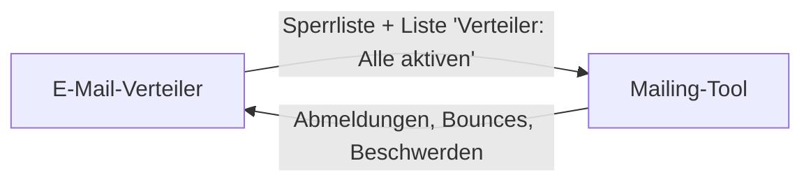

# E-Mail-Verteiler – Abo-Status, Postfach und Mailing-Abgleich (05.10.2026)

> [!summary] Kurzfassung
> Zwei Erweiterungen für [[2026-10-02 E-Mail-Verteiler|den E-Mail-Verteiler]]:
> 1. **Abo-Status**: Die Spalte „Subscription Status“ (subscribed /
>    unsubscribed) aus dem Reach-Kontaktexport wird beim Import ausgewertet.
>    *unsubscribed* kommt direkt auf die Sperrliste.
> 2. **Postfach**: Das Tool liest ein eigenes Microsoft-365-Postfach und
>    übernimmt alle Adressen aus **Absender, An, CC und Mailtext** als
>    Kontakte. Weiterleiten oder in CC setzen genügt. Verbunden wird im
>    Backend über den vorhandenen Microsoft-Login.
> 3. **Mailing-Tool** (`mailing.rss-fb.com`): automatischer Abgleich. Die
>    Sperrliste geht hin, die Empfängerliste „Verteiler: Alle aktiven“ geht hin,
>    Abmeldungen und Bounces kommen zurück.

## Abo-Status

| Wert | Ergebnis |
|---|---|
| subscribed / leer | normaler Import |
| unsubscribed | Sperrliste (abgemeldet), bestehender Kontakt wird gesperrt |
| bounced / cleaned | Sperrliste (harter Bounce) |
| complained | Sperrliste (Beschwerde) |
| anderes (z. B. pending) | nicht importiert, in der Vorschau aufgelistet |

- „Subscribed At“ wird als Einwilligungsdatum erkannt.
- Doppelte Adresse in der Datei: „abgemeldet“ gewinnt.

## Postfach

- Verbinden im Backend: Verteiler → **Postfach** → „Mit Microsoft verbinden“,
  mit dem Konto, das Vollzugriff auf das Verteiler-Postfach hat
- Nutzt die **App des Intranet-Logins** mit eigener Umleitungs-URI
  `https://intern.rss-fb.com/verteiler/`. Der Intranet-Login bleibt unverändert.
- Nur Lesezugriff. Mails werden nicht verschoben oder gelöscht. Gespeichert
  werden nur Betreff, Zeitpunkt und Zahlen. Das Token liegt nicht in DB oder Backups.
- Übersprungen werden eigene Domains, das Postfach selbst, noreply/System-
  und gesperrte Adressen. Bestehende Kontakte werden nur ergänzt.

> [!warning] Einwilligung
> Adressen aus Mails haben meist keine Newsletter-Einwilligung (§ 7 UWG).
> Vor dem Versand die Einwilligung klären und im Kontakt eintragen.

## Mailing-Tool

- Alle 10 Minuten (Ein/Aus im Backend, Seite **Mailing-Tool**), sonst per Knopf
- Geplante Sendungen an inzwischen gesperrte Adressen werden im Mailing-Tool
  sofort abgebrochen
- Kampagnen im Mailing-Tool an die Liste **„Verteiler: Alle aktiven“** schicken
- Schnittstelle `POST /api/integration/verteiler` im Mailing-Tool, abgesichert
  durch ein gemeinsames Token (`VERTEILER_SYNC_TOKEN` dort, `MAILING_SYNC_TOKEN` hier)

## Einrichtung

1. Token erzeugen: `openssl rand -hex 32`, in beide `.env`-Dateien eintragen
2. Mailing-Tool: `git pull && docker compose up -d --build`
3. Verteiler: `git pull origin main`, dann in `deploy/`:
   `docker compose up -d --build --remove-orphans`
4. Entra: bei der Intranet-App die Umleitungs-URI `https://intern.rss-fb.com/verteiler/`
   ergänzen
5. Freigegebenes Postfach `verteiler@fb-eng.de` anlegen und dem eigenen Konto
   Vollzugriff geben
6. Im Verteiler: **Postfach** → verbinden → Adresse eintragen → automatisch
   abrufen. Danach **Mailing-Tool** → jetzt abgleichen → automatisch.

Details: `deploy/DEPLOY.md` (Verteiler) und `DEPLOY.md` im Mailing-Repo.

## Tests

- 39 automatische Tests im Verteiler grün, Microsoft und Mailing-Tool dabei
  simuliert: Verbinden, State-Schutz, Token-Austausch, kein Zugriff,
  Widerruf, doppelte Mails, Abgleich, falsches Token
- Mailing-Tool: 20 Prüfungen gegen eine echte Postgres-DB, Ende-zu-Ende mit
  dem Verteiler. Eine Abmeldung über den Link im Mailing-Tool landete beim
  nächsten Abgleich auf der Sperrliste des Verteilers.
- Oberfläche getestet: Reach-Export mit 5 Zeilen → 2 neu, 2 abgemeldet →
  Sperrliste, 1 „pending“ übersprungen

> [!note] Ablage
> Diese Notiz liegt auch im Repo unter `docs/2026-10-05 Verteiler – Abo-Status und Postfach.md`.
